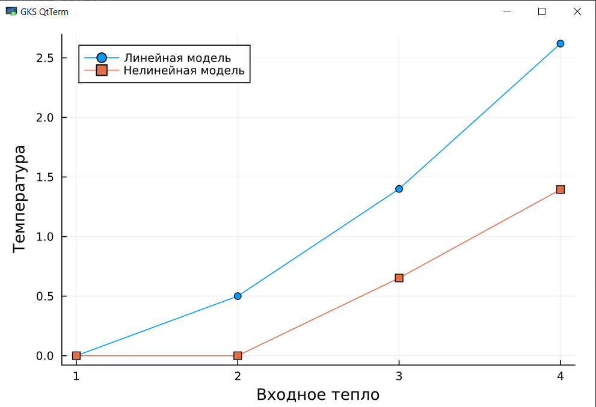

<p align="center"> Министерство образования Республики Беларусь</p>
<p align="center">Учреждение образования</p>
<p align="center">“Брестский Государственный технический университет”</p>
<p align="center">Кафедра ИИТ</p>
<br><br><br><br><br><br><br>
<p align="center">Лабораторная работа №1</p>
<p align="center">По дисциплине “Общая теория интеллектуальных систем”</p>
<p align="center">Тема: “Моделирования температуры объекта”</p>
<br><br><br><br><br>
<p align="right">Выполнил:</p>
<p align="right">Студент 2 курса</p>
<p align="right">Группы ИИ-24</p>
<p align="right">Кураш А. Ю.</p>
<p align="right">Проверил:</p>
<p align="right">Иванюк Д. С.</p>
<br><br><br><br><br>
<p align="center">Брест 2023</p>

---

# Общее задание #
1. Написать отчет по выполненной лабораторной работе №1 в .md формате (readme.md) и с помощью запроса на внесение изменений (**pull request**) разместить его в следующем каталоге: **trunk\ii0xxyy\task_01\doc** (где **xx** - номер группы, **yy** - номер студента, например **ii02102**).
2. Исходный код написанной программы разместить в каталоге: **trunk\ii0xxyy\task_01\src**.

## Task 1. Modeling controlled object ##
Let's get some object to be controlled. We want to control its temperature, which can be described by this differential equation:

$$\Large\frac{dy(\tau)}{d\tau}=\frac{u(\tau)}{C}+\frac{Y_0-y(\tau)}{RC} $$ (1)

where $\tau$ – time; $y(\tau)$ – input temperature; $u(\tau)$ – input warm; $Y_0$ – room temperature; $C,RC$ – some constants.

After transformation we get these linear (2) and nonlinear (3) models:

$$\Large y_{\tau+1}=ay_{\tau}+bu_{\tau}$$ (2)
$$\Large y_{\tau+1}=ay_{\tau}-by_{\tau-1}^2+cu_{\tau}+d\sin(u_{\tau-1})$$ (3)

where $\tau$ – time discrete moments ($1,2,3{\dots}n$); $a,b,c,d$ – some constants.

Task is to write program (**Julia**), which simulates this object temperature.

---

# Выполнение задания #

Код программы:
```C++
#include <iostream>
#include <vector>
#include <cmath>

std::vector<double> simulate_linear_model(double a, double b, const std::vector<double>& u) {
    std::vector<double> y(u.size(), 0.0); // Создание вектора y с нулевыми значениями
    y[0] = 0.0; // Начальная температура
    for (int t = 1; t < u.size(); ++t) {
        y[t] = a * y[t-1] + b * u[t-1];
    }
    return y;
}

std::vector<double> simulate_nonlinear_model(double a, double b, double c, double d, const std::vector<double>& u) {
    std::vector<double> y(u.size(), 0.0); // Создание вектора y с нулевыми значениями
    y[0] = 0.0; // Начальная температура
    y[1] = 0.0; // Температура на втором временном шаге
    for (int t = 2; t < u.size(); ++t) {
        y[t] = a * y[t-1] - b * pow(y[t-2], 2) + c * u[t-1] + d * sin(u[t-2]);
    }
    return y;
}

int main() {
    // Пример использования
    double a_linear = 0.8;
    double b_linear = 0.5;
    std::vector<double> u_linear = {1.0, 2.0, 3.0, 4.0}; // Значения входящего тепла для линейной модели

    double a_nonlinear = 0.8;
    double b_nonlinear = 0.5;
    double c_nonlinear = 0.2;
    double d_nonlinear = 0.3;
    std::vector<double> u_nonlinear = {1.0, 2.0, 3.0, 4.0}; // Значения входящего тепла для нелинейной модели

    std::vector<double> linear_result = simulate_linear_model(a_linear, b_linear, u_linear);
    std::vector<double> nonlinear_result = simulate_nonlinear_model(a_nonlinear, b_nonlinear, c_nonlinear, d_nonlinear, u_nonlinear);
    
    return 0;
}
```     
**График:**


